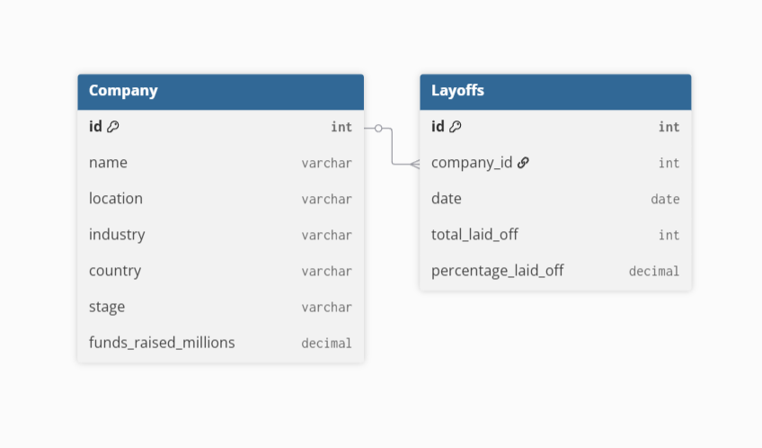

# world-layoffs-data-cleaning
MySQL project on cleaning a global layoffs dataset
# 📊 Global Layoffs Data Cleaning (MySQL Project)

A SQL-based data cleaning project using a real-world layoffs dataset.  
The aim is to transform messy, inconsistent raw data into a clean and reliable dataset, ready for further analysis or visualization.  

---

## 🗂 Dataset
- **File:** layoffs.csv  
- **Columns include:** Company, Location, Industry, Total Laid Off, Percentage Laid Off, Date, Stage, Country, Funds Raised (Millions).  

**Issues in raw data:**
- Duplicate rows  
- Null or blank values in `industry`
- Dates stored as text instead of `DATE`  
- Numbers stored as strings  

---

## 🎯 Objectives
- Remove duplicate records  
- Standardize inconsistent text fields  
- Convert dates into SQL `DATE` type  
- Convert numeric fields into proper types  
- Create an **ER diagram** to represent structure  

---
**Approach** : **Company Table Idea**

As an improvement, I introduced a Company table to store company details, with the Layoffs table referencing it via a foreign key. This reduces data duplication, ensures consistency, and makes it easier to analyze layoffs by company attributes.


----

 


***CODE FOR REFERENCE***
```ruby
 SELECT * 
 FROM ( SELECT company, industry, total_laid_off, `date`, 
 ROW_NUMBER() OVER 
 ( PARTITION BY company, industry, total_laid_off, `date` ) 
 AS row_num 
 FROM world_layoffs.layoffs_staging ) duplicates 
 WHERE row_num > 1;  
 ```
 
```ruby
FROM world_layoffs.layoffs_staging2
ORDER BY industry;

UPDATE layoffs_staging2
SET industry = 'Crypto'
WHERE industry IN ('Crypto Currency', 'CryptoCurrency');
```
```ruby
 SELECT *
FROM world_layoffs.layoffs_staging2
WHERE total_laid_off IS NULL;


SELECT *
FROM world_layoffs.layoffs_staging2
WHERE total_laid_off IS NULL
AND percentage_laid_off IS NULL;

*** Delete Useless data we can't really use***
DELETE FROM world_layoffs.layoffs_staging2
WHERE total_laid_off IS NULL
AND percentage_laid_off IS NULL;
```
